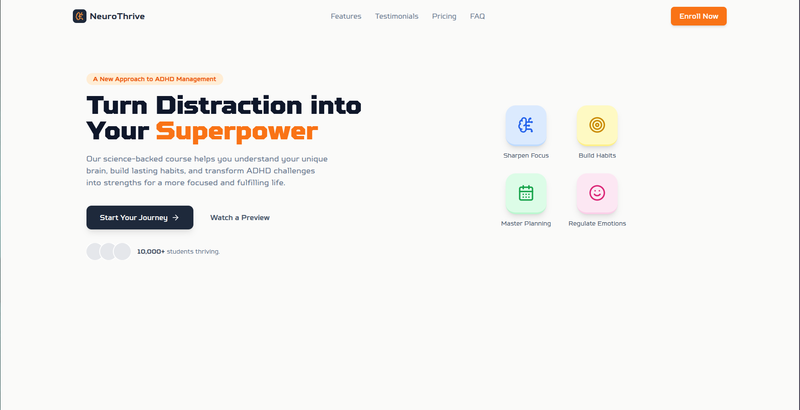

# NeuroThrive - ADHD Management Platform

NeuroThrive is a modern web application designed to help individuals with ADHD transform their challenges into strengths. Built with Next.js and modern web technologies, it provides a science-backed approach to ADHD management.



## Features

- 🧠 Science-backed ADHD management strategies
- 📱 Responsive design for all devices
- ⚡ Fast and smooth animations
- 🎯 Interactive habit-building tools
- 📊 Progress tracking
- 🔒 Secure and private

## Tech Stack

- **Framework:** [Next.js 14](https://nextjs.org/)
- **Styling:** [Tailwind CSS](https://tailwindcss.com/)
- **Animations:** [Framer Motion](https://www.framer.com/motion/)
- **Icons:** [Lucide Icons](https://lucide.dev/)
- **Language:** [TypeScript](https://www.typescriptlang.org/)

## Getting Started

### Prerequisites

- Node.js 18.17 or later
- npm or yarn package manager

### Installation

1. Clone the repository:
   ```bash
   git clone https://github.com/yourusername/neurothrive.git
   cd neurothrive
   ```

2. Install dependencies:
   ```bash
   npm install
   # or
   yarn install
   ```

3. Run the development server:
   ```bash
   npm run dev
   # or
   yarn dev
   ```

4. Open [http://localhost:3000](http://localhost:3000) in your browser to see the result.

## Project Structure

```
neurothrive/
├── public/             # Static files
│   ├── favicon.svg    # App icon
│   └── manifest.json  # PWA manifest
├── src/
│   ├── app/          # Next.js app directory
│   │   ├── layout.tsx
│   │   └── page.tsx
│   └── components/   # React components
├── tailwind.config.ts # Tailwind configuration
└── package.json      # Project dependencies
```

## Development

- `npm run dev` - Start development server
- `npm run build` - Build for production
- `npm run start` - Start production server
- `npm run lint` - Run ESLint
- `npm run type-check` - Run TypeScript type checking

## Contributing

1. Fork the repository
2. Create your feature branch (`git checkout -b feature/amazing-feature`)
3. Commit your changes (`git commit -m 'Add some amazing feature'`)
4. Push to the branch (`git push origin feature/amazing-feature`)
5. Open a Pull Request

## License

This project is licensed under the MIT License - see the [LICENSE](LICENSE) file for details.

## Acknowledgments

- [Next.js Documentation](https://nextjs.org/docs)
- [Tailwind CSS Documentation](https://tailwindcss.com/docs)
- [Framer Motion Documentation](https://www.framer.com/motion/)
- [Lucide Icons](https://lucide.dev/)

## Contact

Your Name - [@yourtwitter](https://twitter.com/yourtwitter)
Project Link: [https://github.com/yourusername/neurothrive](https://github.com/yourusername/neurothrive)
